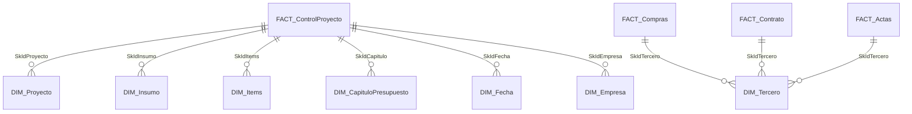

# Modelo de Datos: Datamart ADP (Control de Proyectos)

Este documento proporciona una visión integral del modelo de datos diseñado para el control financiero y presupuestal de los proyectos de construcción en ADPRO.

## Objetivo del Modelo

Centralizar la información de presupuestos, proyecciones, contratos y compras para permitir un análisis en tiempo real del **Costo Ejecutado vs Presupuesto** por proyecto, capítulo e ítem.

## Arquitectura (Esquema Estrella)

El modelo sigue un diseño de esquema estrella optimizado para herramientas de BI como Power BI y Power Pivot.

## Componentes del Modelo

### Tablas de Hechos (Fact Tables)

1. **[ADP_DTM_FACT_ControlProyecto](ADP_DTM_FACT_ControlProyecto.md)**: Tabla central de control. Contiene los valores consolidados de presupuesto, proyección, asegurado, consumido e invertido utilizando claves foráneas.
2. **[ADP_DTM_VFACT_ControlProyecto](ADP_DTM_VFACT_ControlProyecto.md)**: Vista denormalizada (tabla plana) que incluye todas las descripciones de las dimensiones para análisis ad-hoc.
3. **Tablas Transaccionales**: `FACT_Compras`, `FACT_Contrato`, `FACT_Actas` (No documentadas individualmente en esta fase, pero fuentes de `ControlProyecto`).

### Tablas de Dimensión (Dimensions)

- **[DIM_Proyecto](ADP_DTM_DIM_Proyecto.md)**: Jerarquía geográfica y operativa (Macroproyecto > Proyecto > Sucursal).
- **[DIM_Insumo](ADP_DTM_DIM_Insumo.md)**: Catálogo detallado de materiales y mano de obra.
- **[DIM_Items](ADP_DTM_DIM_Items.md)**: Estructura de ítems de presupuesto basada en "Item No".
- **[DIM_CapituloPresupuesto](ADP_DTM_DIM_CapituloPresupuesto.md)**: Grandes rubros de obra.
- **[DIM_Tercero](ADP_DTM_DIM_Tercero.md)**: Maestro de proveedores y contratistas.
- **[DIM_Fecha](ADP_DTM_DIM_Fecha.md)**: Calendario estándar.
- **[DIM_Empresa](ADP_DTM_DIM_Empresa.md)**: Contexto legal de la organización.

## Lógicas de Negocio Globales

- **Manejo de IVA**: Los valores reportados en el modelo de control incluyen IVA, reflejando el compromiso total del proyecto.
- **Nombre de Medidas**: Todas las medidas DAX deben seguir el estándar de nombrado con prefijo `DB_`.
- **Métrica Clave**: El "Valor Total" en `ControlProyecto` es la base para el seguimiento del costo real.

## Recomendaciones de Uso

1. **Jerarquías**: Utilizar siempre las jerarquías definidas en las dimensiones para permitir el "Drill-down" en los informes.
2. **Optimización**: Se han marcado múltiples columnas como "Informativas" u "Obsoletas" en las dimensiones. Se recomienda ocultarlas en la vista de informe de Power BI para simplificar la experiencia del usuario final.
